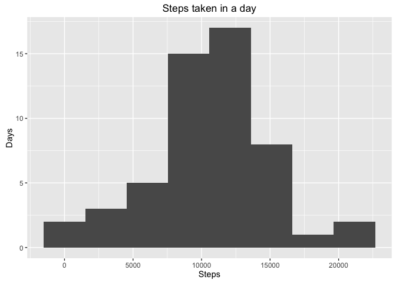
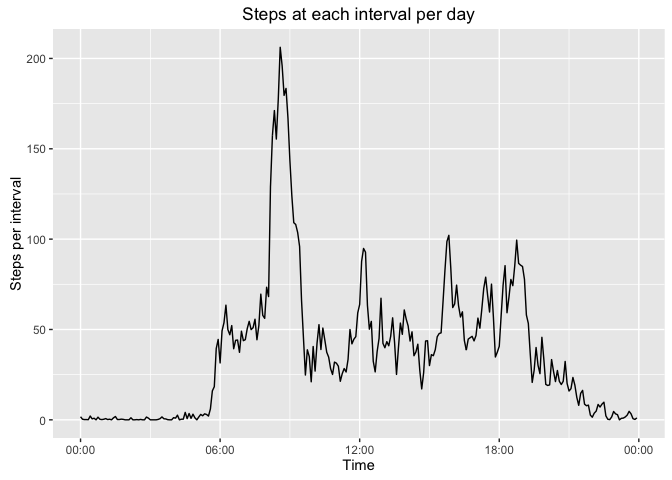
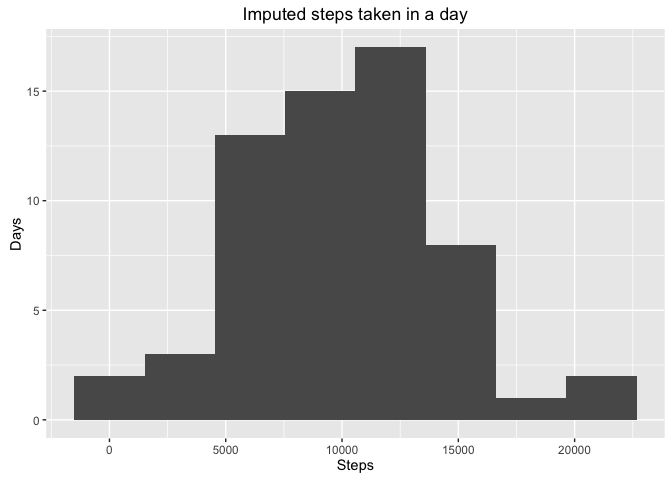
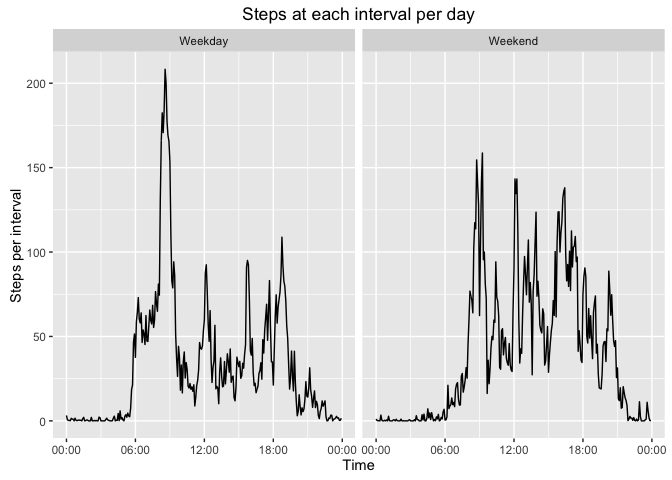

# Week 2 assignment: Recorded steps
Joshua Solomon  
September 11, 2016  


The purpose of this assignment is to demonstrate use of R Markdown and knitr in presentation of data.

##Loading and processing the data
The data needs to be processed first.

```r
unzip("activity.zip")
activity <- read.csv("activity.csv")
activity$interval <- sprintf("%04d", activity$interval)
activity$datetime <- as.POSIXct(strptime(as.character(paste(activity$date, activity$interval)), "%Y-%m-%d %H%M", tz = "America/New_York"))
if("dplyr" %in% rownames(installed.packages()) == FALSE) {
    install.packages("dplyr")}
library(dplyr)
```

```
## 
## Attaching package: 'dplyr'
```

```
## The following objects are masked from 'package:stats':
## 
##     filter, lag
```

```
## The following objects are masked from 'package:base':
## 
##     intersect, setdiff, setequal, union
```

```r
activity <- activity %>% mutate(datetime = datetime) %>% mutate(date = as.Date(as.character(date), "%Y-%m-%d"))
```

##What is mean total number of steps taken per day?
To answer this question, I grouped the data, plotted a histogram, and found the mean and median of the data.  Note that NA values were removed.  Also of note is that the distribution is nearly normal.

```r
steptotal <- activity %>% group_by(date) %>%
    summarize(sum = sum(steps))
if("ggplot2" %in% rownames(installed.packages()) == FALSE) {
    install.packages("ggplot2")}
library(ggplot2)
qplot(steptotal$sum, bins = 8, xlab = "Steps", ylab = "Days", 
    main = "Steps taken in a day", na.rm = TRUE)
```

<!-- -->

```r
mean_median <- as.data.frame(summarize(steptotal, 
    Mean = mean(sum, na.rm = TRUE), 
    Median = median(sum, na.rm = TRUE)))
print(mean_median)
```

```
##       Mean Median
## 1 10766.19  10765
```

##What is the average daily activity pattern?
Daily activity pattern was assessed by averaging data at each time interval over the entire data set (NA's were ignored) and plotting a time series.

```r
activity$interval_time <- strftime(strptime(activity$interval, "%H%M",
    tz = "America/New_York"), "%H:%M:%S")
intervalsteps <- activity %>% group_by(interval_time) %>%
    summarize(steps_interval = mean(steps, na.rm = TRUE))
intervalsteps$POSIX <- as.POSIXct(intervalsteps$interval_time, 
    format = "%H:%M:%S", tz = "America/New_York")
if("scales" %in% rownames(installed.packages()) == FALSE) {
    install.packages("scales")}
library(scales)
ggplot(intervalsteps, aes(POSIX, steps_interval)) + geom_line() +
    scale_x_datetime(labels = date_format("%H:%M", 
    tz = "America/New_York")) + labs(x = "Time", 
    y = "Steps per interval", 
    title = "Steps at each interval per day")
```

<!-- -->

The interval with the maximum average of steps was computed below:

```r
subset(as.data.frame(intervalsteps), 
    steps_interval %in% max(steps_interval), 
    select = c(interval_time, steps_interval))
```

```
##     interval_time steps_interval
## 104      08:35:00       206.1698
```

## Imputing missing values
There are a large number of NA values in this set.

```r
mean(is.na(activity$steps))
```

```
## [1] 0.1311475
```

Thus, I am imputing missing data.  To do this, I am using the K-means clusering algorithm in the impute package from Bioconductor.

```r
if("impute" %in% rownames(installed.packages()) == FALSE) {
    source("https://bioconductor.org/biocLite.R")
    biocLite("impute")}
library(impute)
impute <- as.data.frame(impute.knn(as.matrix(cbind(activity$steps,
    as.integer(activity$interval))))$data)
```

```
## Cluster size 17568 broken into 8784 8784 
## Cluster size 8784 broken into 4445 4339 
## Cluster size 4445 broken into 2250 2195 
## Cluster size 2250 broken into 1111 1139 
## Done cluster 1111 
## Done cluster 1139 
## Done cluster 2250 
## Cluster size 2195 broken into 862 1333 
## Done cluster 862 
## Done cluster 1333 
## Done cluster 2195 
## Done cluster 4445 
## Cluster size 4339 broken into 2195 2144 
## Cluster size 2195 broken into 980 1215 
## Done cluster 980 
## Done cluster 1215 
## Done cluster 2195 
## Cluster size 2144 broken into 2044 100 
## Cluster size 2044 broken into 1174 870 
## Done cluster 1174 
## Done cluster 870 
## Done cluster 2044 
## Done cluster 100 
## Done cluster 2144 
## Done cluster 4339 
## Done cluster 8784 
## Cluster size 8784 broken into 4401 4383 
## Cluster size 4401 broken into 2275 2126 
## Cluster size 2275 broken into 2007 268 
## Cluster size 2007 broken into 845 1162 
## Done cluster 845 
## Done cluster 1162 
## Done cluster 2007 
## Done cluster 268 
## Done cluster 2275 
## Cluster size 2126 broken into 928 1198 
## Done cluster 928 
## Done cluster 1198 
## Done cluster 2126 
## Done cluster 4401 
## Cluster size 4383 broken into 2187 2196 
## Cluster size 2187 broken into 976 1211 
## Done cluster 976 
## Done cluster 1211 
## Done cluster 2187 
## Cluster size 2196 broken into 1220 976 
## Done cluster 1220 
## Done cluster 976 
## Done cluster 2196 
## Done cluster 4383 
## Done cluster 8784
```

```r
steps_impute <- impute %>% select(V1) %>% 
    rename(steps_imputed = V1)
activity_impute <- cbind(steps_impute, activity[,-1])
```

A histogram including the imputed data is plotted below:

```r
step_impute_total <- activity_impute %>% group_by(date) %>%
    summarize(sum = sum(steps_imputed))
qplot(step_impute_total$sum, bins = 8, xlab = "Steps", ylab = "Days", 
    main = "Imputed steps taken in a day")
```

<!-- -->

As seen above, only a minor change was made in one of the bars of the histogram.  Similarly, a very small decrease in mean and median were calculated below.  Although I have not done an inferential analysis, I feel that the change is not statistically significant.

```r
mean_median_imputed <- as.data.frame(summarize(step_impute_total, 
    Mean = mean(sum), 
    Median = median(sum)))
print(mean_median_imputed)
```

```
##       Mean Median
## 1 10131.02  10395
```

## Are there differences in activity patterns between weekdays and weekends?
In order to answer this question, the data have to be first be grouped by day of the week, then by weekday and weekend.

```r
activity_impute <- mutate(activity_impute, weekday = weekdays(datetime))
weekdaylist <- subset(activity_impute, 
    weekday == "Monday" | weekday == "Tuesday" | 
    weekday == "Wednesday" | weekday == "Thursday" | 
    weekday == "Friday")
weekdaylist$day <- "Weekday"
weekendlist <- subset(activity_impute, weekday == "Saturday" |
    weekday == "Sunday")
weekendlist$day <- "Weekend"
activity_weekday <- rbind(weekdaylist, weekendlist)
```

To assess the patterns, I plotted the data between the two facets of **weekday** and **weekend**.  It appears that there is no spike at 6:00 AM on the weekend and that the spike around 8:30 AM is not as high in the weekend facet as it is in the weekday facet.  This makes sense in that the spikes probably refer to waking and getting to work on a weekday.

```r
interval_impute <- activity_weekday %>% 
    group_by(interval_time, day) %>%
    summarize(steps_interval = mean(steps_imputed))
interval_impute$POSIX <- as.POSIXct(interval_impute$interval_time, 
    format = "%H:%M:%S", tz = "America/New_York")
ggplot(interval_impute, aes(POSIX, steps_interval)) + geom_line() + 
    facet_grid(. ~ day) +
    scale_x_datetime(labels = date_format("%H:%M", 
    tz = "America/New_York")) + labs(x = "Time", 
    y = "Steps per interval", 
    title = "Steps at each interval per day")
```

<!-- -->
